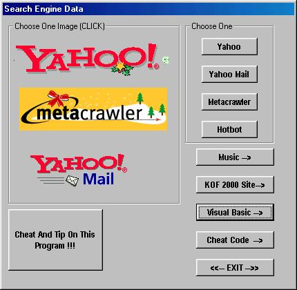



## Web Collection Broswer \!\!

### Description

This is a program with lots of shortcut like music, mail, search engines, cheats, trainer, visual basic and much more!! Include Tip And Trick About My program!!(My Program Can Even Do Cheats!!) So Download, relax and enjoy using this program, just one click!! Remember to rate it Please!!
 
### More Info
 

             |
---                |---
**Submitted On**   |2000-12-30 13:56:04
**By**             |[N/A](https://github.com/Planet-Source-Code/PSCIndex/blob/master/ByAuthor/empty.md)
**Level**          |Beginner
**User Rating**    |3.8 (19 globes from 5 users)
**Compatibility**  |VB 3\.0, VB 4\.0 \(16\-bit\), VB 4\.0 \(32\-bit\), VB 5\.0, VB 6\.0, VB Script, ASP \(Active Server Pages\) , VBA MS Access, VBA MS Excel
**Category**       |[Coding Standards](https://github.com/Planet-Source-Code/PSCIndex/blob/master/ByCategory/coding-standards__1-43.md)
**World**          |[Visual Basic](https://github.com/Planet-Source-Code/PSCIndex/blob/master/ByWorld/visual-basic.md)
**Archive File**   |[CODE\_UPLOAD1316112302000\.zip](https://github.com/Planet-Source-Code/web-collection-broswer__1-13943/archive/master.zip)

